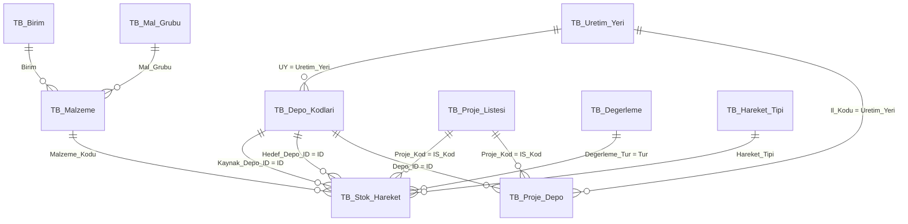

# Adım 2: İlişki Diyagramı ve Kurulum

## ER Diyagramı



## ASCII Diyagram

```
TB_Uretim_Yeri (6510=SAMSUN, 6520=ORDU, ...)
    │
    ├──< TB_Depo_Kodlari (498 depo)
    │       │
    │       ├──< TB_Stok_Hareket.Kaynak_Depo_ID
    │       ├──< TB_Stok_Hareket.Hedef_Depo_ID
    │       └──< TB_Proje_Depo.Depo_ID
    │
    └──< TB_Proje_Depo.Il_Kodu

TB_Malzeme (9809 malzeme)
    ├── Mal_Grubu >── TB_Mal_Grubu
    ├── Birim >────── TB_Birim
    └──< TB_Stok_Hareket.Malzeme_Kodu

TB_Proje_Listesi (395 proje)
    ├──< TB_Stok_Hareket.Proje_Kod
    └──< TB_Proje_Depo.Proje_Kod

TB_Hareket_Tipi (GIRIS, CIKIS, NAKIL, HARCAMA, IADE, SAYIM)
    └──< TB_Stok_Hareket.Hareket_Tipi

TB_Degerleme (ARIZALI, HURDA, ...)
    └──< TB_Stok_Hareket.Degerleme_Tur
```

## Access'te İlişki Kurulumu

### Yöntem A: İlişkiler Penceresi (önerilen)

1. **Veritabanı Araçları** → **İlişkiler**
2. Tüm tabloları ekle
3. Aşağıdaki ilişkileri sürükle-bırak ile kur
4. Her ilişkide **Bütünlüğü Tümle** işaretle
5. **Basamaklı Güncelle** ve **Basamaklı Sil** işaretleme (hareket tablosu için silme kapatılmalı)

### Yöntem B: SQL ile (sınırlı destek)

Access'te ALTER TABLE ile FK ekleme sınırlıdır; İlişkiler penceresi tercih edilir.

## İlişki Listesi

| # | Ana Tablo | Ana Alan | İlişkili Tablo | İlişkili Alan | Tür |
|---|-----------|----------|----------------|---------------|-----|
| 1 | TB_Uretim_Yeri | Uretim_Yeri | TB_Depo_Kodlari | UY | 1:N |
| 2 | TB_Depo_Kodlari | ID | TB_Stok_Hareket | Kaynak_Depo_ID | 1:N |
| 3 | TB_Depo_Kodlari | ID | TB_Stok_Hareket | Hedef_Depo_ID | 1:N |
| 4 | TB_Malzeme | Malzeme_Kodu | TB_Stok_Hareket | Malzeme_Kodu | 1:N |
| 5 | TB_Birim | Birim | TB_Malzeme | Birim | 1:N |
| 6 | TB_Mal_Grubu | Mal_grubu | TB_Malzeme | Mal_Grubu | 1:N |
| 7 | TB_Proje_Listesi | IS_Kod | TB_Stok_Hareket | Proje_Kod | 1:N |
| 8 | TB_Proje_Listesi | IS_Kod | TB_Proje_Depo | Proje_Kod | 1:N |
| 9 | TB_Depo_Kodlari | ID | TB_Proje_Depo | Depo_ID | 1:N |
| 10 | TB_Uretim_Yeri | Uretim_Yeri | TB_Proje_Depo | Il_Kodu | 1:N |
| 11 | TB_Degerleme | Tur | TB_Stok_Hareket | Degerleme_Tur | 1:N |
| 12 | TB_Hareket_Tipi | Hareket_Tipi | TB_Stok_Hareket | Hareket_Tipi | 1:N |

## İndeks Önerileri

Access'te tablo tasarımından veya SQL ile indeks ekleyin:

```sql
-- TB_Stok_Hareket performans indeksleri
CREATE INDEX idx_hareket_tarih ON TB_Stok_Hareket (Tarih);
CREATE INDEX idx_hareket_malzeme ON TB_Stok_Hareket (Malzeme_Kodu);
CREATE INDEX idx_hareket_kaynak ON TB_Stok_Hareket (Kaynak_Depo_ID);
CREATE INDEX idx_hareket_hedef ON TB_Stok_Hareket (Hedef_Depo_ID);
CREATE INDEX idx_hareket_proje ON TB_Stok_Hareket (Proje_Kod);
CREATE INDEX idx_hareket_tip ON TB_Stok_Hareket (Hareket_Tipi);
CREATE INDEX idx_hareket_bakiye ON TB_Stok_Hareket (Malzeme_Kodu, Kaynak_Depo_ID, Proje_Kod);
```

## İş Kuralları (İlişki Düzeyinde)

| Hareket Tipi | Kaynak Depo | Hedef Depo | Proje | Açıklama |
|--------------|:-----------:|:----------:|:-----:|----------|
| GIRIS | - | Zorunlu | - | Hedef depoya giriş |
| CIKIS | Zorunlu | - | - | Kaynak depodan çıkış |
| NAKIL | Zorunlu | Zorunlu | - | Kaynak → Hedef transfer |
| HARCAMA | Zorunlu | - | Zorunlu | Proje bazlı tüketim |
| IADE | - | Zorunlu | - | Depoya iade |
| SAYIM | Zorunlu | - | - | Sayım farkı düzeltmesi |

## Proje-Depo Eşleme Başlangıç Verisi

Mevcut 5 genel PROJE deposunu kullanarak başlangıç eşlemesi:

```sql
-- Her ilin PROJE deposunu TB_Proje_Depo'ya bağla
-- (Proje kodları sonradan tek tek veya toplu eklenecek)

INSERT INTO TB_Proje_Depo (Proje_Kod, Depo_ID, Il_Kodu, Aktif, Aciklama)
SELECT IS_Kod, '6510-PROJ', '6510', True, 'Samsun proje deposu'
FROM TB_Proje_Listesi
WHERE Il_Kodu = '6510' OR Il_Kodu IS NULL;
-- Not: Il_Kodu alanı doldurulduktan sonra çalıştırın
```
